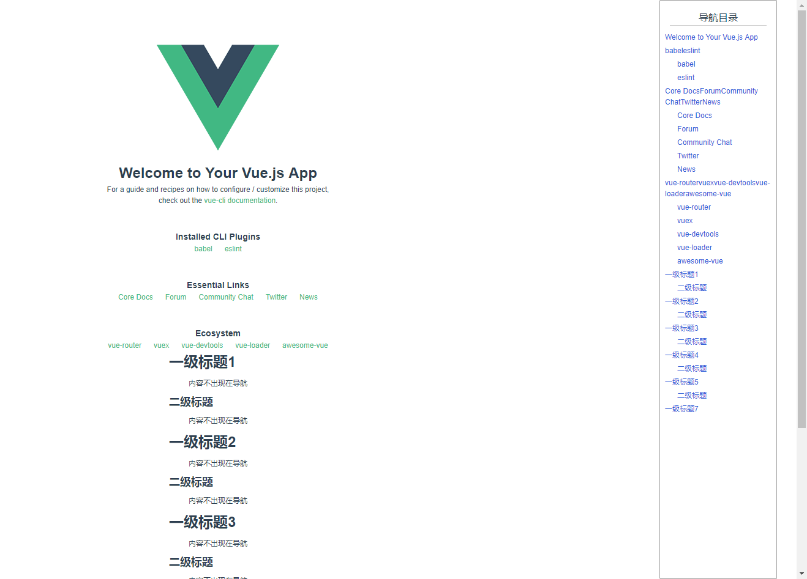

# vue-outline
<a href="./changeLog.md">更新日志</a>

一个Vue页面生成导航的小工具，使用非常简单。  
你可以通过设置选择器，为符合选择器的元素创建大纲。并且可以设置排除选择器，不匹配符合该选择器的元素。 
vue-outline实质是通过匹配选择器，在匹配的元素前插入一个a标签并分配唯一的id属性，然后将匹配元素的innerText属性（默认）以及a标签返回。
vue-outline本身是一个指令，你可以为你的Vue模板中的任意一个元素以下dom树生成大纲导航。类似下面这样为页面生成一个导航目录：


## 安装
```
npm install vue-outline
```
或者
```
yarn add vue-outline
```

## 引入
方法1： outline本身是一个指令插件, 你可以调用Vue.use把outline注册为全局指令：
```
import outline from 'vue-outline'
Vue.use(outline)
```
方法2：通过解构赋值将outline解构出来，通过Vue.directive注册为全局指令
```
import { outline } from 'vue-outline'
Vue.directive('your-directive-name', outline)
```
方法3：注册为组件局部指令
```
<script>
// ···
import { outline } from 'vue-outline'
export default {
  // ···
  directives: {
    'your-directive-name': outline
  }
  // ···
}
</script>
```

## 使用
通过v-outline(或者你自定义的指令名来调用), 需要给指令传值如下：
| 值 | 类型 | 说明 | 必传 | 默认值 |
|---|---|--| --- | --- |
| callback | Function | 接收生成的树形结构数据 | 是 | 无 |
| selectors | Array | 一个选择器的列表 | 否 | ['h1', 'h2'] |
| exceptSelector | String | 排除掉的选择器 | 否 | 无 |

例如：
```
// template
<div
  v-outline="{
    callback: refreshNavTree,
    selectors: ['h1,ul', 'li,h2'],
    exceptSelector: '[un-nav]'
  }>

</div>

refreshNavTree (treeData) {
  this.navTree = treeData
}
```
## 大纲导航数据的展示
你可以选择一个树形组件来显示大纲导航数据，不过vue-outline还是内置了一个树形组件<a href="https://www.npmjs.com/package/simple-vue-tree">simple-tree</a>，你可以直接使用：
```
<simple-tree
  :treeData="navTree"
  :expand="false"
  class="tree">
  <div slot-scope="{ data, parentData }">
    <div
      class="node-render-content"
      @click.stop="jumpToAnchor(data.id)">
      {{ data.title }}
    </div>
  </div>
</simple-tree>

// ···
jumpToAnchor (id) {
  let element = document.getElementById(id)
  if (element) {
    element.scrollIntoView({ behavior: 'smooth', block: 'start', inline: 'nearest' })
  }
}
// ···
```
完整示例例子请查看<a href="./src/components/HelloWOrld.vue">demo</a>。  
关于更多<a href="https://www.npmjs.com/package/simple-vue-tree">simple-tree</a>具体细节可以查看一下这个组件的<a href="https://www.npmjs.com/package/simple-vue-tree">文档</a>。

------
你可以从github克隆本项目，运行查看例子。

## Project setup
```
yarn install
```

### Compiles and hot-reloads for development
```
yarn run serve
```

### Compiles and minifies for production
```
yarn run build
```

### Lints and fixes files
```
yarn run lint
```
